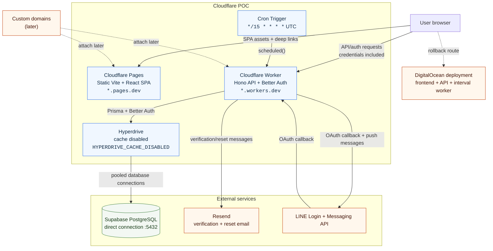

# Cloudflare Deployment

TutorPal's POC keeps the frontend and backend on separate Cloudflare services:

- Cloudflare Pages serves the static Vite/React SPA from `frontend/dist`.
- A Cloudflare Worker serves the Hono API and owns the fifteen-minute reminder Cron.
- PostgreSQL remains the system of record through a Hyperdrive binding with
  query caching disabled.
- The existing DigitalOcean deployment remains available for rollback.

## Architecture overview



The Pages site is a static origin; the browser calls the Worker directly using
the build-time `VITE_API_URL`. The Worker is the only application component
that accesses PostgreSQL or the external email and LINE providers. The Cron
Trigger invokes the same Worker `scheduled()` handler used by the reminder
polling flow. Dashed edges represent future domain attachment or the existing
DigitalOcean rollback path.

## Temporary URLs

Use stable service URLs during the POC. Do not use per-commit Pages preview
URLs for the application configuration because authentication cookies, email
links, CORS, and LINE OAuth require fixed origins.

After creating the services, record:

- `PAGES_URL`: the stable Pages `https://<project>.pages.dev` URL.
- `WORKER_URL`: the stable Worker `https://<worker>.<account>.workers.dev` URL.

Custom domains can be attached later without changing the service boundaries.
When they are added, update the origin variables and the Pages build variable
together.

## Pages

Create a Git-integrated Pages project with:

- Root directory: `frontend`
- Build command: `bun run generate:api && bun run build --mode dev`
- Output directory: `dist`
- Build variable: `VITE_API_URL=WORKER_URL`

The site is a static SPA. Pages supplies the deep-link fallback to
`index.html`; do not add Pages Functions or a backend `_worker.js` artifact.
The frontend-specific notes and rollback steps are in
[`frontend/README.md`](../frontend/README.md).

## Worker and Cron

The backend Worker configuration is [`backend/wrangler.jsonc`](../backend/wrangler.jsonc)
and the entrypoint is `backend/src/cloudflare-worker.ts`. The Worker creates
Prisma, Better Auth, repositories, and services for each invocation. The
existing [`backend/src/index.ts`](../backend/src/index.ts) Bun API entrypoint
and [`backend/src/worker.ts`](../backend/src/worker.ts) interval worker remain
available for DigitalOcean rollback and local development.

Before the first deploy:

1. Create a Hyperdrive configuration for the existing PostgreSQL database with
   query caching disabled.
2. Replace the all-zero Hyperdrive ID in `backend/wrangler.jsonc` with the
   resulting configuration ID.
3. Keep the Hyperdrive binding name as `HYPERDRIVE_CACHE_DISABLED`; it must
   match the name read by `backend/src/cloudflare-worker.ts`.
4. Replace the example Pages and Worker origins in `backend/wrangler.jsonc`
   with `PAGES_URL` and `WORKER_URL`.
5. Store the secrets below with the Cloudflare Worker secret store. Do not put
   them in Git, Pages variables, or `VITE_*` variables.
6. Run `bun run cf:check` from `backend`, then deploy the Worker with Wrangler.

If the Worker reports `Missing required Cloudflare Worker binding:
HYPERDRIVE_CACHE_DISABLED`, the deployed version is using a binding name that
does not match the source configuration. Deploy the current
`backend/wrangler.jsonc`; do not create this as a secret or a regular variable.

The Cron expression is `*/15 * * * *` (every 15 minutes, in UTC). Reminder delivery
is safe across overlapping invocations through the existing PostgreSQL claim,
lease fencing, retry key, and delivery status logic.

## Runtime configuration

Set these Worker variables to the stable temporary URLs:

| Variable | Value |
| --- | --- |
| `CORS_ORIGIN` | `PAGES_URL` |
| `FRONTEND_URL` | `PAGES_URL` |
| `BETTER_AUTH_URL` | `WORKER_URL` |
| `EMAIL_VERIFICATION_CALLBACK_URL` | `PAGES_URL/verify-email` |
| `LINE_LINK_REDIRECT_URL` | `WORKER_URL/v1/line/callback` |
| `ENVIRONMENT` | `production` or the selected POC environment |
| `LOG_LEVEL` | `info` |
| `RESEND_FROM_EMAIL` | Verified sender identity |

Store these as Worker secrets:

- `BETTER_AUTH_SECRET`
- `RESEND_API_KEY`
- `LINE_CREDENTIALS_ENCRYPTION_KEY`

Keep the existing authentication and LINE encryption secret values unchanged
so existing sessions and encrypted LINE credentials remain compatible with the
POC database.

## Verification

Run the local checks before deployment:

```text
cd frontend
bun run generate:api && bun run build --mode dev

cd ../backend
bun run cf:check
bun test
```

Then verify against the temporary URLs:

- Pages `/`, `/login`, and representative TanStack Router deep links load the
  SPA shell.
- API CORS allows the Pages origin with credentials, and authentication covers
  sign-up, verification, reset, refresh, and logout.
- Existing encrypted LINE credentials can be read, LINE OAuth returns to the
  Worker callback, and a test message succeeds.
- CRUD, transactions, timestamps, decimals, and the reminder claim query work
  through Hyperdrive.
- A reminder Cron run claims and sends due deliveries once, retries transient
  failures, and does not duplicate a delivery when invocations overlap.

## Rollback

Keep the Pages deployment isolated on its `pages.dev` URL until the POC passes.
If the custom-domain cutover fails, restore the affected DNS records to the
existing DigitalOcean static site described in
[`../.do/frontend-dev.app.yaml`](../.do/frontend-dev.app.yaml), then verify the
root page and one client-side route. The DigitalOcean API and interval reminder
worker remain available through the existing deployment path.
